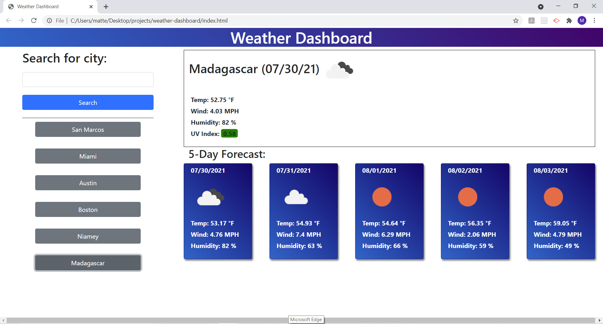

# Weather Dashboard

Search weather results by city and store up to 6 of your most recent search results for easy re-call as an easily accessible button.

This program will give you the current, as well as a five day forecast including a colorized UV index dispay.

This application is perfect for planning a trip or just comparing weather across several cities.

This program uses a combination of HTML,CSS,JavaScript,Bootstrap,Moment.js, and retrieves informataion from the openweather.org API.

[See what the weather is like now!](https://mattersievers.github.io/weather-dashboard/)

